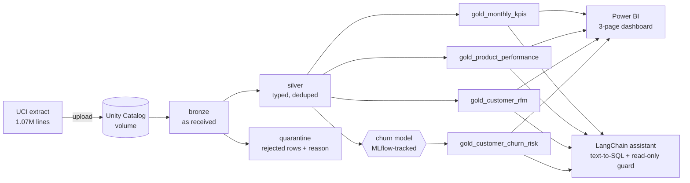
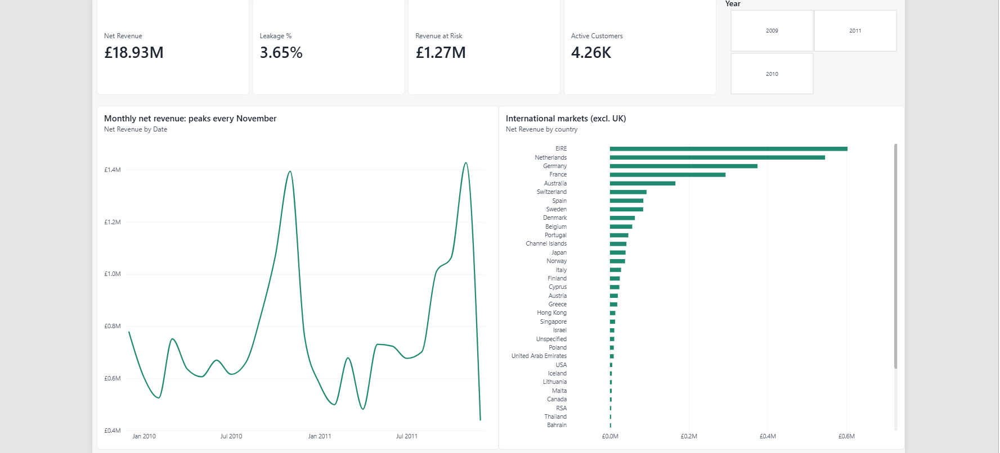
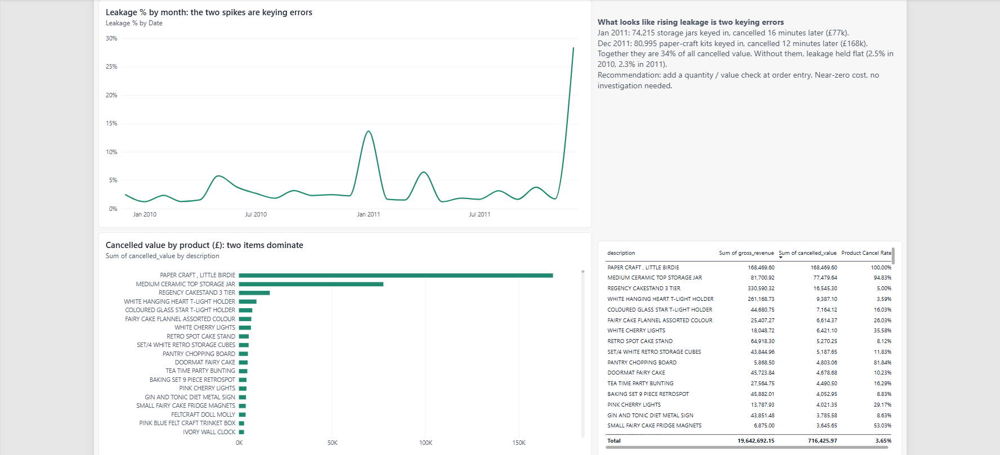
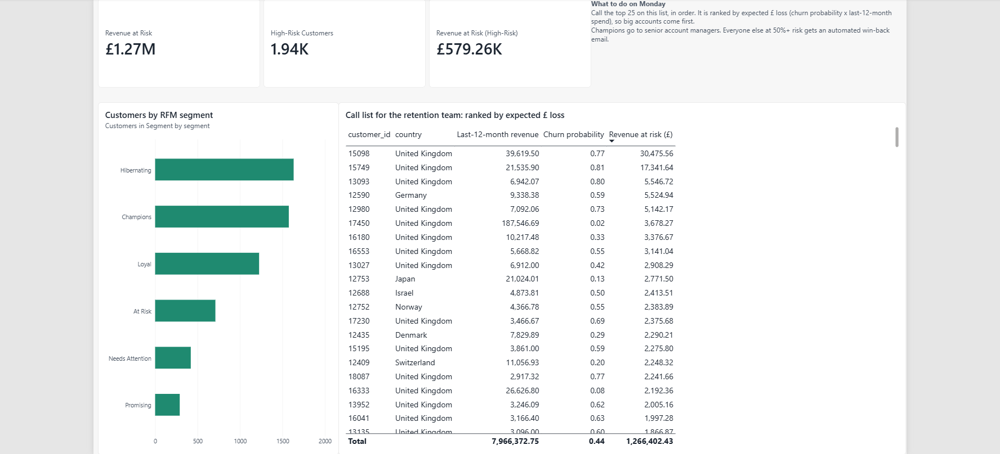

# Retail Revenue Rescue

**An end-to-end data & AI consulting engagement on real retail data: from a client question to a governed lakehouse, a churn model, a Power BI dashboard and a GenAI assistant, ending in a recommendation with a £ figure.**

`Databricks` · `Unity Catalog` · `Delta / medallion` · `Databricks Workflows` · `PySpark` · `MLflow` · `scikit-learn` · `Power BI / DAX` · `LangChain` · `gpt-oss-120b (Groq)` · `DuckDB` · `pytest + GitHub Actions`

> 🎥 **3-minute demo:** _add your video link here_ · 📊 **Findings deck:** [`deck/`](deck/)

---

## The client problem
A UK online gift retailer (real data: [UCI Online Retail II](https://archive.ics.uci.edu/dataset/502/online+retail+ii), 1.07M invoice lines, 2009–2011) asked:
*"Where are we leaking revenue, which valuable customers are about to stop ordering, and how much is at stake?"* Full brief: [`docs/problem_statement.md`](docs/problem_statement.md)

## What I found
| | Finding | So what |
|---|---|---|
| 1 | Cancellation "leakage" appears to **double in 2011 (2.5% → 4.8%)**, but **34% of all cancelled value (£246k) comes from just two keying errors**: bulk orders of 80,995 and 74,215 units, each reversed within 16 minutes. Underlying leakage was **flat (2.5% → 2.3%)**. | Don't launch a returns investigation. A **quantity sanity check at order entry** costs almost nothing and stops these swings from distorting reporting. |
| 2 | **£1.27M of the next year's revenue is at risk** from 4,261 active customers (16% of their £7.97M annual spend). | Retention is worth funding. |
| 3 | **100 customers (2% of the base) hold £203k of that risk**, ranked by *expected £ loss* (probability × spend), so big accounts with moderate risk outrank small accounts that are certain to leave. | A **call list** for account managers instead of a blanket discount. Automated win-back emails for the other 1,905 customers with ≥50% churn probability (£462k at risk). |
| 4 | **Champions (1,576 customers) bring 77% of annual revenue.** | Protect them first: any Champion on the call list goes to a senior account manager. |

**Model credibility:** validated **out-of-time** (trained on June 2011, tested on September 2011, a period it never saw). **AUC 0.76 vs 0.71** for the rule the business already uses ("longest since last order"). The top 10% of flagged customers churn at **76% vs a 49% base rate**.

**Scenario** (assumption, stated): if account calls retain 20% of the at-risk revenue on the call list, that's **≈ £41k/yr from 100 account-manager calls**, before any automated win-back.

## What I built

The four steps run as one **Databricks Workflow** (also defined as code in [`databricks.yml`](databricks.yml)).

| Layer | Where | Notes |
|---|---|---|
| Transformations | [`retail/transforms.py`](retail/transforms.py) | Pure PySpark functions, unit-tested locally with Databricks' strict ANSI SQL mode on |
| Notebooks | [`notebooks/`](notebooks/) | Thin: narrative + calls into the tested package |
| Churn model | [`retail/churn.py`](retail/churn.py), [`04_churn_model`](notebooks/04_churn_model.py) | Out-of-time validation, baseline comparison, each score traceable to its MLflow run |
| Dashboard | [`powerbi/`](powerbi/) | Ratio-of-sums DAX measures, call-list page |
| AI assistant | [`assistant/`](assistant/) | Shows its SQL, retries once on SQL errors, blocks non-SELECT queries, scored on a 10-question eval ([results](assistant/eval_results.md)) |
| Consulting docs | [`docs/`](docs/) | Brief, [platform decision record](docs/adr-001-platform.md), [runbook](docs/runbook.md) |

### Dashboard
| Executive overview | Revenue leakage | Churn call list |
|---|---|---|
|  |  |  |

## Decisions worth asking me about
- **Quarantine, don't delete.** 11,908 rows (postage, fees, bad-debt entries, zero-price lines) are kept in `silver_quarantine` with a reason. The job **fails** if fewer than 90% of rows pass, so a broken extract can't silently reach the dashboard.
- **Out-of-time validation, not a random split.** A random split leaks future behaviour and flatters the model.
- **Gold stores additive numbers only.** Leakage % is computed in DAX as a ratio of sums, so it's correct at any level of aggregation.
- **The local tests caught a production bug.** Customers who only ever cancelled caused a divide-by-zero under ANSI mode (Databricks serverless default). It was fixed with `try_divide` and a regression test.
- **The assistant is guarded twice:** a SQL guard (single SELECT, no file-reading functions, row cap) *and* a read-only credential in production. Neither layer is trusted on its own.
- **Vendor-neutral by design:** swapping Groq for Azure OpenAI is a one-function change, and gold is plain Delta/Parquet. See the [ADR](docs/adr-001-platform.md) for why Databricks over Glue/ADF here.

## Run it
**Local, about 2 minutes, no cloud account needed.** Gold tables are committed, so the assistant works straight away.
```bash
pip install -r requirements.txt
cp .env.example .env    # add a free GROQ_API_KEY from console.groq.com
streamlit run assistant/app.py
python -m assistant.eval          # re-score the assistant
```
**Full pipeline locally:** `pip install -r requirements-dev.txt && PYTHONPATH=. python scripts/run_local.py` (Java 8/11/17 required).
**Tests:** `PYTHONPATH=. pytest -q`.
**On Databricks:** see [`GETTING_STARTED.md`](GETTING_STARTED.md).

## Next phase (what I'd propose to the client)
1. Add cost-of-goods data, so findings are in **margin**, not revenue.
2. **A/B test** the retention call list against a control group to measure real uplift, not assumed uplift.
3. Move the assistant onto a service principal with `SELECT`-only grants, and log every question for review.
